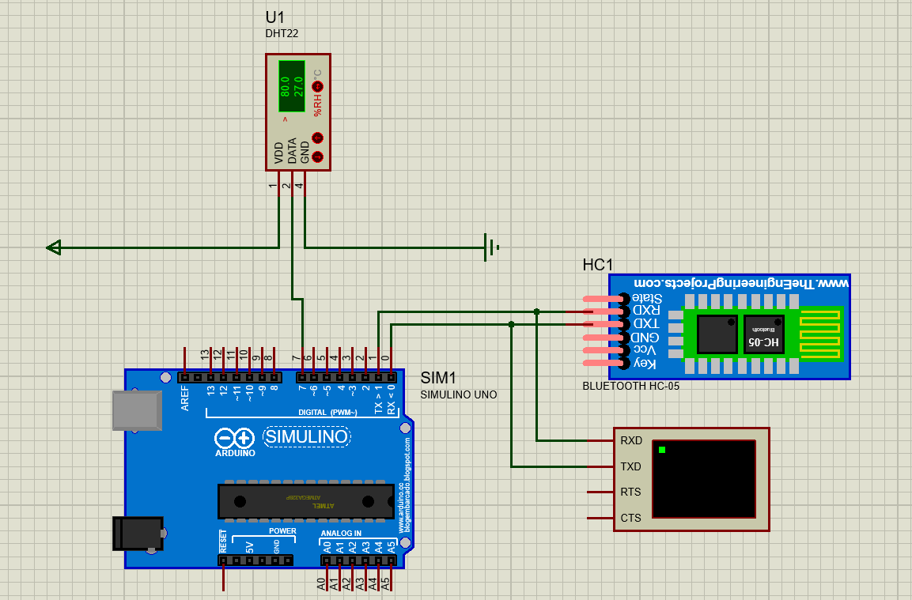

# DHT-Python-Dashboard
## Objective
The main objective of this project was to create a solution that could retrieve data from a DHT22 sensor, store it into a data base, retrieve it from there and use it to recreate a dashboard using "Dash" library. 
## Components 
This project uses a simulation of a DHT22 sensor using Proteus, also there's a HTC-05 sensor that send the data via bluetooth for us to retrieve it using virtual serial ports and an Arduino One, in this repository you can find both files. There's also two scripts, one called "update_db.py" which creates the db, if it exists it updates the data; and the "graph_data.py" which graphs the data into a "webpage" that uses a local server provided by "Dash". 

## Python Libraries required 
* dash
* dash-renderer 
* dash-html-componentes 
* dash-core-components 
* plotly
* pyserial 

## Procedure
* Humedad means Humity
* Temperatura means Temperature
* Tiempo is the time_stamp
* Máximos y Mínimos" means "Max and Min values 

### Frist step 
Download the Proteus project with the .ino file, compile the .ino and copy the .hex file that Arduino provides. Double click into the Arduino One plate on Proteus and copy that link. If everything is done correctly you'll be able to run the program and see a Virtual Terminal pop up that shows the data coming from the DHT22 sensor. 

### Second step 
Download the "update_db.py" Python file and execute it, this will create a data base with the name "DHT_DB" and a table named "Data". 

### Third step 
Download the "graph_data.py" Python file and execute it, this will open a new tab in your browser with all the information you collected presented in different graphs.

### Images 

